# ☕ UI/UX CoffeeStyle Websites - TailWind CSS
## 👋👋 Index

- [About](#🔰-about)
- [Usage](#📝-usage)
- [Technology](#🔧-technology)
- [Gallery](#📷-screenshots) 
- [LiveDemo](#🚩-demo)

## 🔰 About
- This is the first project I did while learning Tailwind CSS.
- Project is the interface of a website selling coffee and tea.
- The interface is compatible with many different screen sizes.

## 📝 Usage
### ⚠️Requirements
- **nodejs >= v14.7.0**
- **npm >= v6.14.7**
```
$ git clone https://github.com/huyhoang-doit/CoffeeStyle.git
$ cd <project_dir>
$ npm install
$ npm run build:css
$ npm run start:dev
```

## 🔧 Technology
 &nbsp; &nbsp; 

## 📷 Screenshots
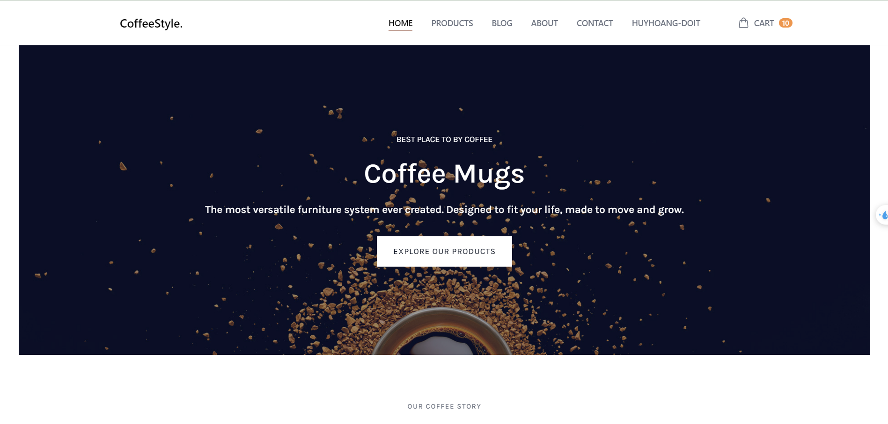&nbsp;
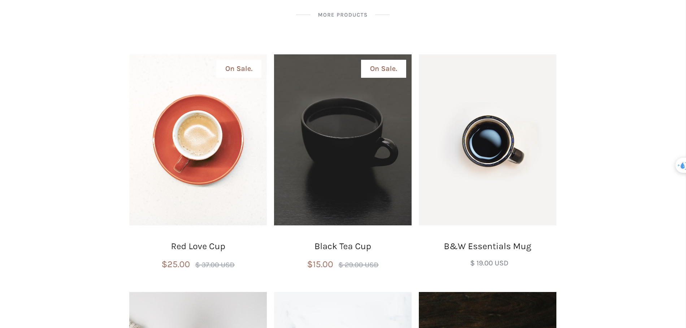&nbsp;
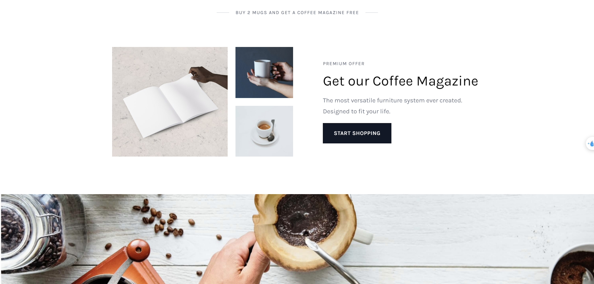&nbsp;
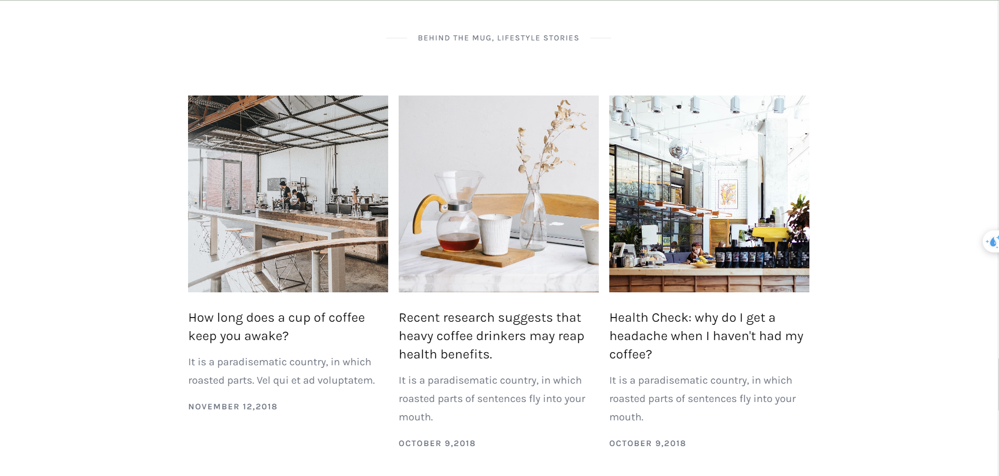&nbsp;
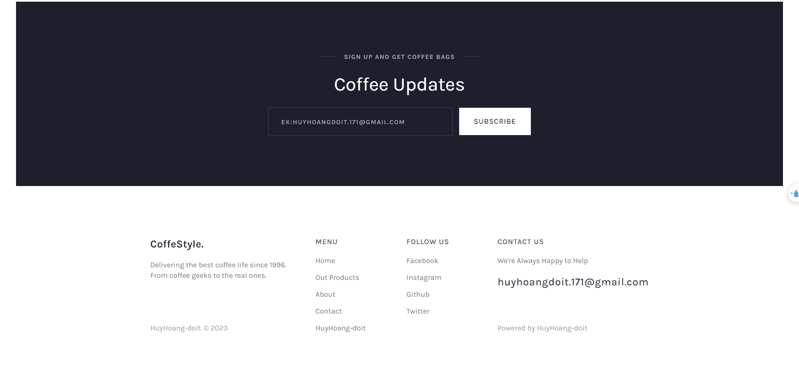&nbsp;
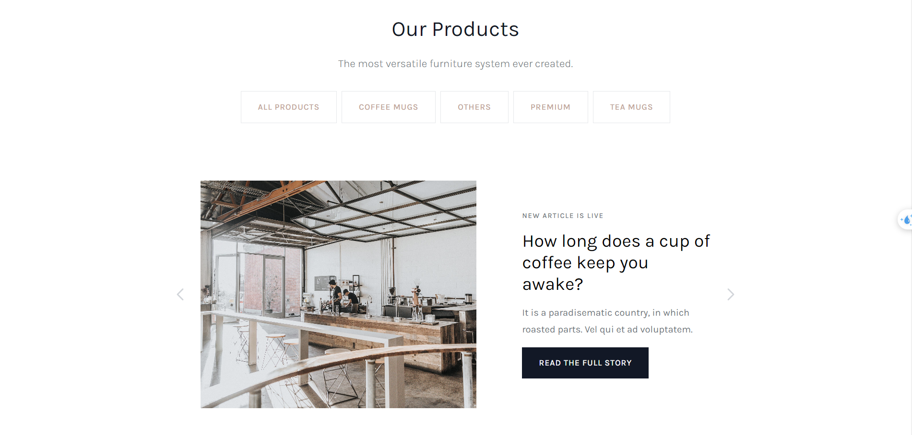&nbsp;
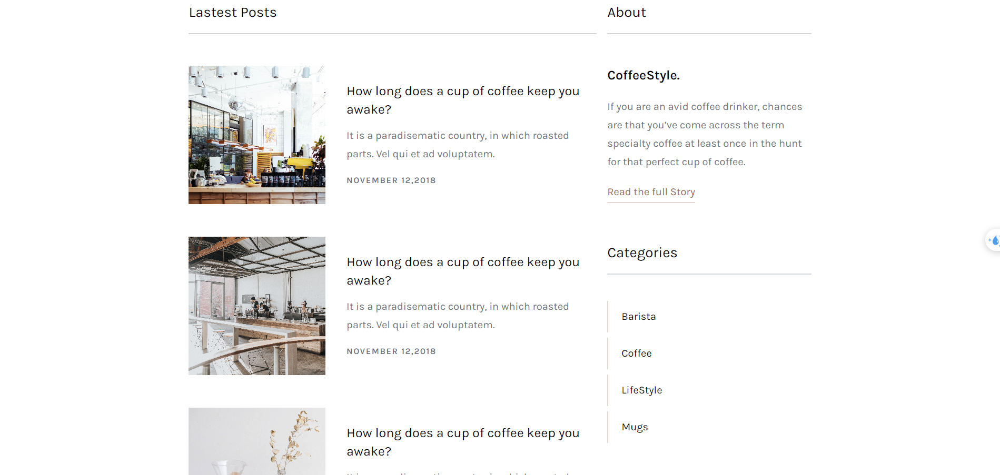&nbsp;
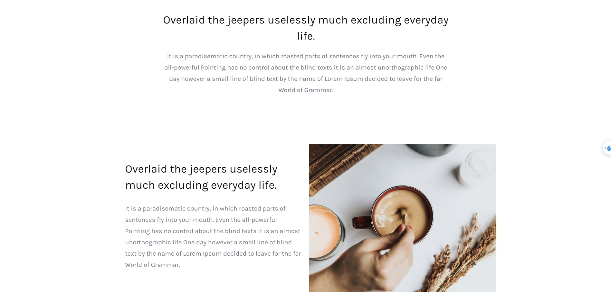&nbsp;
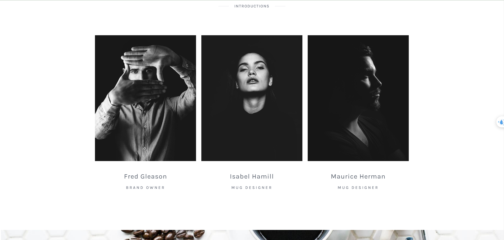&nbsp;
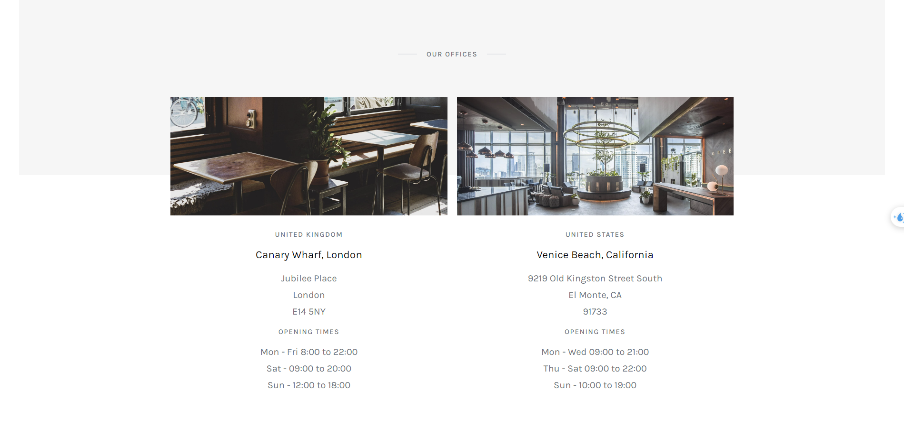&nbsp;
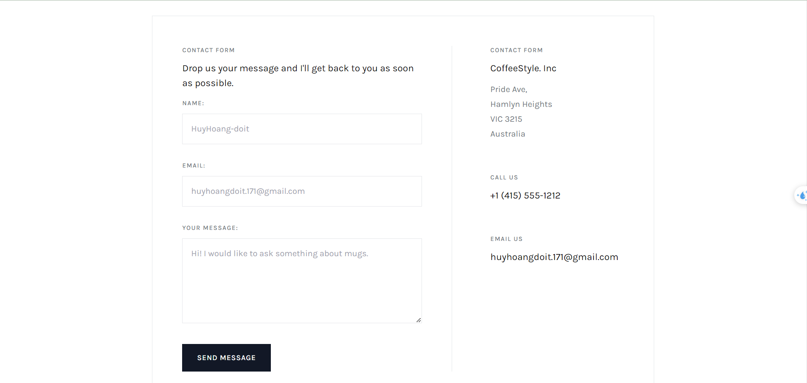&nbsp;
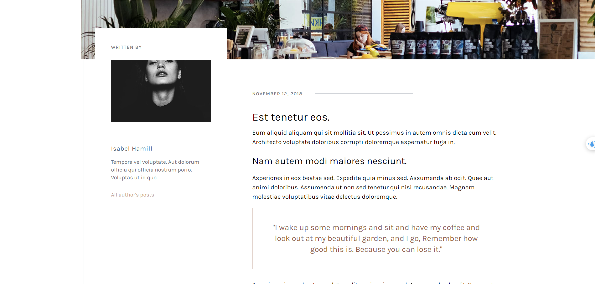&nbsp;
&nbsp;
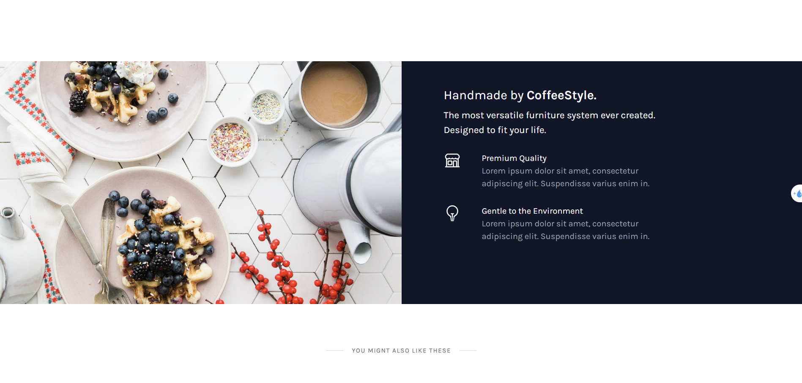&nbsp;
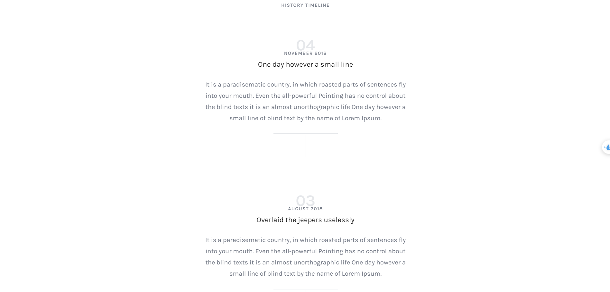&nbsp;

## 🚩 Demo
🌐 [CoffeeStyle-hdi](https://coffeestyle-huyhoang-doi-72ce4.web.app/)

### Huyhoang-doit 🙋

